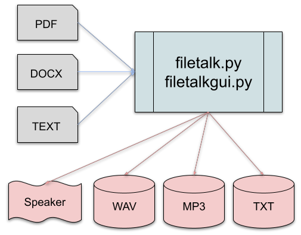

# file-talk
Convert documents .pdf, .docx, .txt to audio files



This software requires two other system programs:
- __espeak-ng__  
  see: https://github.com/espeak-ng/espeak-ng/blob/master/docs/guide.md
- __ffmpeg__  
  see: https://ffmpeg.org/download.html
  
Also:

```c
>pip install --pre python-docx  # for MS Word docs
>pip install PyPDF3  # for .pdf documents
>pip install argparse  # for command line help
>pip install ttkbootstrap  # for GUI
```
filetalk.py and filetalkgui.py  
are written in Python 3.10.6

```bash
usage: filetalk.py [-h] [-v VOICE] [-s SPEED] [-p PITCH] [-mp3] [-txt] infile outfile

Converts textual content from a PDF, Word, or Text file into speech or audo file. REQUIRES:
"espeak-ng" and "ffmpeg"

positional arguments:
  infile      input file: .txt, .pdf, or .docx only
  outfile     output file (no .ext) or "talk"

options:
  -h, --help  show this help message and exit
  -v VOICE    espeak-ng voice code. Dft en-us
  -s SPEED    espeak-ng speed 30-300 Dft 150
  -p PITCH    espeak-ng pitch 0-99 Dft 45
  -mp3        make additional mp3 output file
  -txt        make additional text output file
```

These command-line options are incorporated into the GUI version.

end README


